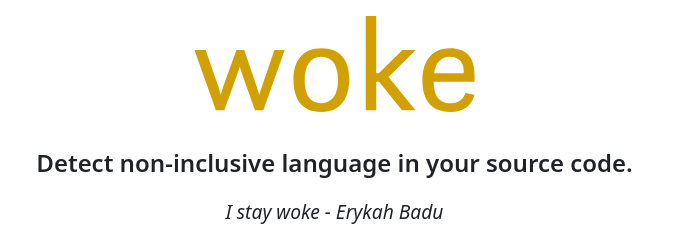
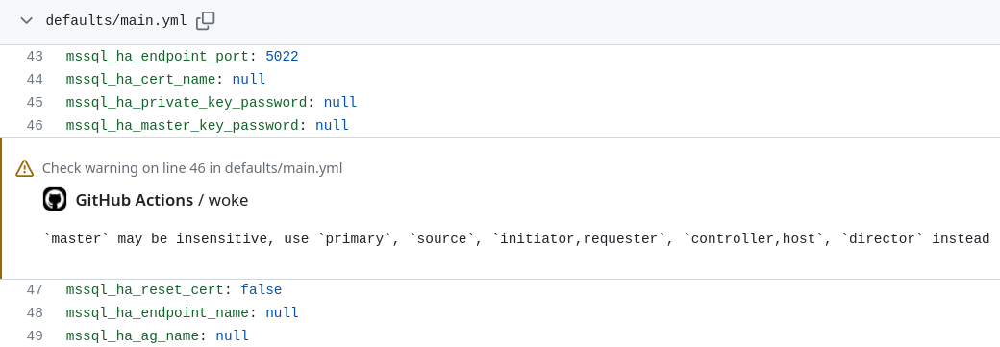

<!--
theme: gaia
class:
 - invert
headingDivider: 2 
paginate: true
-->

<!--
_class:
 - lead
 - invert
-->
<style>
{
  font-size: 28px
}
</style>

# Using woke for Conscious Language Scans

[Sergei Petrosian](mailto:spetrosi@redhat.com)

<!-- https://spetrosi.github.io/use_woke_devconf2023 -->

<!-- Diversity, Equity, and Inclusion (DEI) is a focus of many organizations today.
It is important for all users and developers to feel comfortable using and contributing to open source projects.
Part of this is Inclusive Language, using words and expressions that are inclusive rather than exclusive. -->

## Presentation Outline

1. Why it is Inclusive Language Initiative important?
2. `woke` tool
3. `woke-action` GitHub Action
4. `woke` caveats
5. How linux-system-roles works arounds the caveats
6. Q&A

<!-- The Linux System Roles project has recently begun using a tool called "woke" as part of our github code checking.
During this presentation you will learn about the "woke" tool, how we are using it in Linux System roles github action checking, the hurdles we faced converting Linux System Roles to have more inclusive language, and ways you can help the "woke" project.  -->

## Why it is important?

<!-- The software industry sometimes uses certain words that may carry a great deal of emotional and historical baggage.
If software is truly meant to be inclusive and a place where anyone can participate, it must be welcoming to all.
If words or phrases convey secondary unintended meanings to our audience, we are potentially limiting participation in our projects.

To avoid unintended connotations that some common words and phrases have, we can use more precise words.
Not only does this eliminate the hurt caused by those connotations, it also improves understanding, particularly for people who are reading in a second language, where those idioms may be confusing. -->

1. To be inclusive

2. Improve understanding for people who are reading in a second language, where those idioms may be confusing

## woke

A tool that detects non-inclusive language in your source code.

Features:
1. Searches for non-inclusive terms and their variations
2. Suggests alternatives
3. Different terms might have different serverity levels
4. Customizable configuration file

## woke-action

`woke-action` - GitHub action that allows you to execute woke command within GitHub Actions

```yaml
name: woke
on:
  - pull_request
jobs:
  woke:
    name: woke
    runs-on: ubuntu-latest
    steps:
      - name: Checkout
        uses: actions/checkout@v2

      - name: woke
        uses: get-woke/woke-action@v0
        with:
          # Cause the check to fail on any broke rules
          fail-on-error: true
```

## woke-action in Action



## woke Caveats


- woke fails on errors of all severety levels

  A PR that we opened for woke:
  Add an option "--count-only-error-for-failure" [#252](https://github.com/get-woke/woke/pull/252)

- Lack of activity from the developer

## Workaround

We created a "clone" at [.github/actions/custom-woke-action](https://github.com/linux-system-roles/mssql/tree/main/.github/actions/custom-woke-action)

```yaml
name: Check for non-inclusive language
on:  # yamllint disable-line rule:truthy
  - pull_request
jobs:
  woke:
    name: woke
    runs-on: ubuntu-latest
    steps:
      - name: Checkout
        uses: actions/checkout@v3

      - name: custom woke
        # Originally, uses: get-woke/woke-action@v0
        uses: ./.github/actions/custom-woke-action
        with:
          woke-args: "-c https://raw.githubusercontent.com/linux-system-roles/tox-lsr/main/src/tox_lsr/config_files/woke.yml --count-only-error-for-failure"
          # Cause the check to fail on any broke rules
          fail-on-error: true
```

# 🎉
<!--
_class:
 - lead
 - invert
-->
### Q&A

## References

[Inclusive Naming Initiative FAQ](https://inclusivenaming.org/faqs/)
[woke](https://github.com/get-woke/woke)
[woke-action](https://github.com/get-woke/woke-action)
[.github/actions/custom-woke-action](https://github.com/linux-system-roles/mssql/tree/main/.github/actions/custom-woke-action)
